# VibePower2PowerCode — System Documentation

**Version:** 1.0.0
**Generated:** 2026-05-17 14:51:43 UTC
**Repository:** https://github.com/koopadotai/vs_VibePower2PowerCode
**Audience:** humans + AI agents

> Auto-generated by `vibe-toolkit-doc`. **Do not edit by hand** — edit `vibe-toolkit-doc/lib/system-model.js` and re-run `node vibe-toolkit-doc/index.js`.

## Business Purpose

Migrate Power Apps Vibe projects (make.powerapp.com — Microsoft's low-code React/Vite authoring environment) into Microsoft Power Code (Code First Power Apps using React + TypeScript with the @microsoft/power-apps SDK). Vibe is not directly portable to Power Code: source files are Vite-transformed, data models use friendly field names instead of raw Dataverse names, routing breaks inside the Power Apps player iframe, and connectors must be called via the SDK rather than direct fetch(). This toolkit automates the mechanical work and provides AI-guided assistance for the reasoning work, so a developer can take a Vibe prototype and ship it as a maintainable, deployable Power Code app.

## Executive Summary

VibePower2PowerCode is an AI-assisted migration toolkit. It consists of three Node.js CLIs (vibe-extractor, vibe-verifier, vibe-reporter) plus seven Claude Code skills that orchestrate them. The developer extracts their Vibe app source via Playwright, runs /migrate in Claude Code (which auto-detects first-time vs incremental and adapts the reasoning steps accordingly), optionally generates Playwright verification tests, and optionally produces stakeholder documentation. The system maintains a versioned baseline so every re-extraction from Vibe produces a scoped diff — /migrate Mode B then applies only the changed files instead of re-running the full migration. Version control, test results, and ADRs flow into a single auto-generated project documentation artifact (PROJECT.md + PROJECT.docx) for handover and audit.

## System Overview

The toolkit is composed of:

| Component type | Count |
|---|---|
| actor | 2 |
| external | 6 |
| cli-tool | 6 |
| skill | 10 |
| artifact | 15 |
| handoff | 1 |
| config | 2 |

Plus **63 explicit relationships** between them, **5 named data flows**, and **10 impact-analysis entries**.

## Solution Graph

Three representations of the same graph. Use whichever fits your viewer:

### View 1 — ASCII diagram (for any text viewer)

```
                           ┌─────────────┐
                           │  developer  │
                           └──────┬──────┘
            ┌─────────────────────┼──────────────────────┐
            ▼                     ▼                      ▼
   ┌────────────────┐   ┌──────────────────┐   ┌──────────────────┐
   │ vibe-extractor │   │   claude-code    │   │  vibe-verifier   │
   │  (Playwright)  │   │   (skills/*)     │   │  (Playwright)    │
   └────────┬───────┘   └────────┬─────────┘   └────────┬─────────┘
            │                    │                       │
            │ writes             │ reads + writes        │ reads/writes
            ▼                    ▼                       ▼
   ┌────────────────────────────────────────────────────────────────┐
   │   vibe-source/  vibe-baseline/  vibe-history.json              │
   │   vibe-pending-update.json  vibe-migration.json                │
   │   vibe-baselines-snapshots/v*/                                 │
   └─────────────────────────────┬──────────────────────────────────┘
                                 │                ┌──────────────────┐
                                 ▼                │  vibe-reporter   │
                       ┌──────────────────┐       │  (docx)          │
                       │ [ProjectName]/   │◄──────┤                  │
                       │ (Power Code app) │       └────────┬─────────┘
                       └────────┬─────────┘                │
                                │ npx power-apps push      ▼
                                ▼                ┌──────────────────┐
                       ┌──────────────────┐      │ docs/PROJECT.md  │
                       │ Power Apps player│      │ docs/PROJECT.docx│
                       │ (deployed app)   │      └──────────────────┘
                       └────────┬─────────┘
                                │
                                │ tests run against
                                ▼
                       ┌──────────────────┐      ┌──────────────────┐
                       │   tests/specs/   │─────▶│  github (issues) │
                       │   tests/results/ │      │   via gh CLI     │
                       └──────────────────┘      └──────────────────┘
```

### View 2 — Mermaid (renders in GitHub, VS Code, many Markdown viewers)

```mermaid
graph TD
    developer(["developer<br/><i>actor</i>"])
    claude-code(["claude-code<br/><i>actor</i>"])
    vibe-app>"vibe-app<br/><i>external</i>"]
    power-apps-player>"power-apps-player<br/><i>external</i>"]
    github>"github<br/><i>external</i>"]
    gh-cli>"gh-cli<br/><i>external</i>"]
    playwright>"playwright<br/><i>external</i>"]
    docx>"docx<br/><i>external</i>"]
    vibe-extractor["vibe-extractor<br/><i>cli-tool</i>"]
    vibe-verifier["vibe-verifier<br/><i>cli-tool</i>"]
    vibe-reporter["vibe-reporter<br/><i>cli-tool</i>"]
    vibe-toolkit-doc["vibe-toolkit-doc<br/><i>cli-tool</i>"]
    vibe-fleet["vibe-fleet<br/><i>cli-tool</i>"]
    vibe-patterns["vibe-patterns<br/><i>cli-tool</i>"]
    skill_migrate{{"skill:migrate<br/><i>skill</i>"}}
    skill_verify-migration{{"skill:verify-migration<br/><i>skill</i>"}}
    skill_migration-report{{"skill:migration-report<br/><i>skill</i>"}}
    skill_map-fields{{"skill:map-fields<br/><i>skill</i>"}}
    skill_add-connector{{"skill:add-connector<br/><i>skill</i>"}}
    skill_grill-with-docs{{"skill:grill-with-docs<br/><i>skill</i>"}}
    skill_diagnose{{"skill:diagnose<br/><i>skill</i>"}}
    skill_handoff{{"skill:handoff<br/><i>skill</i>"}}
    skill_karpathy-guidelines{{"skill:karpathy-guidelines<br/><i>skill</i>"}}
    doc_version-control{{"doc:version-control<br/><i>skill</i>"}}
    art_vibe-source[("art:vibe-source<br/><i>artifact</i>")]
    art_vibe-baseline[("art:vibe-baseline<br/><i>artifact</i>")]
    art_vibe-history[("art:vibe-history<br/><i>artifact</i>")]
    art_vibe-baselines-snapshots[("art:vibe-baselines-snapshots<br/><i>artifact</i>")]
    art_vibe-pending-update[("art:vibe-pending-update<br/><i>handoff</i>")]
    art_vibe-migration[("art:vibe-migration<br/><i>artifact</i>")]
    art_power-code-project[("art:power-code-project<br/><i>artifact</i>")]
    art_power-config[/"art:power-config<br/><i>config</i>"/]
    art_context[("art:context<br/><i>artifact</i>")]
    art_adrs[("art:adrs<br/><i>artifact</i>")]
    art_test-specs[("art:test-specs<br/><i>artifact</i>")]
    art_test-results[("art:test-results<br/><i>artifact</i>")]
    art_auth-state[("art:auth-state<br/><i>artifact</i>")]
    art_project-doc[("art:project-doc<br/><i>artifact</i>")]
    art_system-doc[("art:system-doc<br/><i>artifact</i>")]
    art_fleet-config[/"art:fleet-config<br/><i>config</i>"/]
    art_fleet-doc[("art:fleet-doc<br/><i>artifact</i>")]
    art_vibe-patterns[("art:vibe-patterns<br/><i>artifact</i>")]
    developer -->|invokes| vibe-extractor
    developer -->|invokes| claude-code
    developer -->|invokes| vibe-verifier
    developer -->|invokes| vibe-reporter
    vibe-extractor -->|reads| vibe-app
    vibe-extractor ==>|writes| art_vibe-source
    vibe-extractor ==>|writes| art_vibe-baseline
    vibe-extractor ==>|writes| art_vibe-baselines-snapshots
    vibe-extractor ==>|appends| art_vibe-history
    vibe-extractor ==>|writes| art_vibe-pending-update
    vibe-extractor -..->|depends| playwright
    claude-code -->|invokes| skill_migrate
    claude-code -->|invokes| skill_verify-migration
    claude-code -->|invokes| skill_migration-report
    skill_migrate -->|reads| art_vibe-pending-update
    skill_migrate ==>|writes| art_vibe-migration
    skill_migrate -->|reads| art_vibe-source
    skill_migrate ==>|writes| art_power-code-project
    skill_migrate ==>|writes| art_vibe-history
    skill_migrate ==>|writes| art_context
    skill_migrate ==>|writes| art_adrs
    skill_migrate -->|invokes| skill_map-fields
    skill_migrate -->|invokes| skill_add-connector
    skill_migrate -->|invokes| skill_grill-with-docs
    skill_migrate -->|triggers| skill_verify-migration
    skill_migrate -->|triggers| skill_migration-report
    skill_verify-migration -->|invokes| vibe-verifier
    skill_verify-migration ==>|writes| art_test-specs
    skill_verify-migration -->|invokes| skill_diagnose
    vibe-verifier -->|reads| art_test-specs
    vibe-verifier -->|reads| art_auth-state
    vibe-verifier -->|reads| power-apps-player
    vibe-verifier ==>|writes| art_test-results
    vibe-verifier ==>|appends| art_vibe-history
    vibe-verifier -..->|depends| gh-cli
    vibe-verifier ==>|writes| github
    vibe-verifier -..->|depends| playwright
    skill_migration-report -->|invokes| vibe-reporter
    vibe-reporter -->|reads| art_vibe-history
    vibe-reporter -->|reads| art_vibe-migration
    vibe-reporter -->|reads| art_context
    vibe-reporter -->|reads| art_adrs
    vibe-reporter -->|reads| art_power-code-project
    vibe-reporter -->|reads| art_power-config
    vibe-reporter ==>|writes| art_project-doc
    vibe-reporter -..->|depends| docx
    vibe-toolkit-doc ==>|writes| art_system-doc
    vibe-toolkit-doc -..->|depends| docx
    developer -->|invokes| vibe-fleet
    vibe-fleet ==>|writes| art_fleet-config
    vibe-fleet -->|reads| art_vibe-history
    vibe-fleet -->|reads| art_vibe-pending-update
    vibe-fleet -->|reads| art_vibe-migration
    vibe-fleet -->|reads| art_power-config
    vibe-fleet -->|reads| art_context
    vibe-fleet -->|invokes| vibe-extractor
    vibe-fleet -->|invokes| vibe-verifier
    vibe-fleet ==>|writes| art_fleet-doc
    vibe-fleet -..->|depends| docx
    developer -->|invokes| vibe-patterns
    vibe-patterns -->|reads| art_vibe-patterns
    vibe-patterns ==>|writes| art_adrs
    skill_migrate -->|reads| art_vibe-patterns
```



### View 3 — JSON graph spec (for AI agents)

Parse this directly. Each `node` has `id, type, location, entrypoint, invokedAs, ownership`. Each `edge` is `{from, to, type}`.

```json
{
  "nodes": [
    {
      "id": "developer",
      "type": "actor",
      "location": null,
      "entrypoint": null,
      "invokedAs": null,
      "ownership": null
    },
    {
      "id": "claude-code",
      "type": "actor",
      "location": null,
      "entrypoint": null,
      "invokedAs": null,
      "ownership": null
    },
    {
      "id": "vibe-app",
      "type": "external",
      "location": "make.powerapp.com",
      "entrypoint": null,
      "invokedAs": null,
      "ownership": null
    },
    {
      "id": "power-apps-player",
      "type": "external",
      "location": "apps.powerapps.com",
      "entrypoint": null,
      "invokedAs": null,
      "ownership": null
    },
    {
      "id": "github",
      "type": "external",
      "location": null,
      "entrypoint": null,
      "invokedAs": null,
      "ownership": null
    },
    {
      "id": "gh-cli",
      "type": "external",
      "location": null,
      "entrypoint": null,
      "invokedAs": null,
      "ownership": null
    },
    {
      "id": "playwright",
      "type": "external",
      "location": null,
      "entrypoint": null,
      "invokedAs": null,
      "ownership": null
    },
    {
      "id": "docx",
      "type": "external",
      "location": null,
      "entrypoint": null,
      "invokedAs": null,
      "ownership": null
    },
    {
      "id": "vibe-extractor",
      "type": "cli-tool",
      "location": "vibe-extractor/",
      "entrypoint": "node vibe-extractor/index.js",
      "invokedAs": null,
      "ownership": null
    },
    {
      "id": "vibe-verifier",
      "type": "cli-tool",
      "location": "vibe-verifier/",
      "entrypoint": "node vibe-verifier/index.js",
      "invokedAs": null,
      "ownership": null
    },
    {
      "id": "vibe-reporter",
      "type": "cli-tool",
      "location": "vibe-reporter/",
      "entrypoint": "node vibe-reporter/index.js",
      "invokedAs": null,
      "ownership": null
    },
    {
      "id": "vibe-toolkit-doc",
      "type": "cli-tool",
      "location": "vibe-toolkit-doc/",
      "entrypoint": "node vibe-toolkit-doc/index.js",
      "invokedAs": null,
      "ownership": null
    },
    {
      "id": "vibe-fleet",
      "type": "cli-tool",
      "location": "vibe-fleet/",
      "entrypoint": "node vibe-fleet/index.js",
      "invokedAs": null,
      "ownership": null
    },
    {
      "id": "vibe-patterns",
      "type": "cli-tool",
      "location": "vibe-patterns/",
      "entrypoint": "node vibe-patterns/index.js",
      "invokedAs": null,
      "ownership": null
    },
    {
      "id": "skill:migrate",
      "type": "skill",
      "location": "skills/migrate.md",
      "entrypoint": null,
      "invokedAs": "/migrate",
      "ownership": null
    },
    {
      "id": "skill:verify-migration",
      "type": "skill",
      "location": "skills/verify-migration.md",
      "entrypoint": null,
      "invokedAs": "/verify-migration",
      "ownership": null
    },
    {
      "id": "skill:migration-report",
      "type": "skill",
      "location": "skills/migration-report.md",
      "entrypoint": null,
      "invokedAs": "/migration-report",
      "ownership": null
    },
    {
      "id": "skill:map-fields",
      "type": "skill",
      "location": "skills/map-fields.md",
      "entrypoint": null,
      "invokedAs": "/map-fields",
      "ownership": null
    },
    {
      "id": "skill:add-connector",
      "type": "skill",
      "location": "skills/add-connector.md",
      "entrypoint": null,
      "invokedAs": "/add-connector",
      "ownership": null
    },
    {
      "id": "skill:grill-with-docs",
      "type": "skill",
      "location": "skills/grill-with-docs.md",
      "entrypoint": null,
      "invokedAs": "/grill-with-docs",
      "ownership": null
    },
    {
      "id": "skill:diagnose",
      "type": "skill",
      "location": "skills/diagnose.md",
      "entrypoint": null,
      "invokedAs": "/diagnose",
      "ownership": null
    },
    {
      "id": "skill:handoff",
      "type": "skill",
      "location": "skills/handoff.md",
      "entrypoint": null,
      "invokedAs": "/handoff",
      "ownership": null
    },
    {
      "id": "skill:karpathy-guidelines",
      "type": "skill",
      "location": "skills/karpathy-guidelines.md",
      "entrypoint": null,
      "invokedAs": "/karpathy-guidelines",
      "ownership": null
    },
    {
      "id": "doc:version-control",
      "type": "skill",
      "location": "skills/version-control.md",
      "entrypoint": null,
      "invokedAs": null,
      "ownership": null
    },
    {
      "id": "art:vibe-source",
      "type": "artifact",
      "location": "vibe-source/",
      "entrypoint": null,
      "invokedAs": null,
      "ownership": "vibe-extractor writes; /migrate reads."
    },
    {
      "id": "art:vibe-baseline",
      "type": "artifact",
      "location": "vibe-baseline/",
      "entrypoint": null,
      "invokedAs": null,
      "ownership": "vibe-extractor writes (on diff); /migrate Mode A initialises on first run."
    },
    {
      "id": "art:vibe-history",
      "type": "artifact",
      "location": "vibe-history.json",
      "entrypoint": null,
      "invokedAs": null,
      "ownership": "vibe-extractor appends; /migrate Mode A initialises; /migrate Mode B writes `note`; vibe-verifier writes `testResults`."
    },
    {
      "id": "art:vibe-baselines-snapshots",
      "type": "artifact",
      "location": "vibe-baselines-snapshots/v{X.Y.Z}/",
      "entrypoint": null,
      "invokedAs": null,
      "ownership": "vibe-extractor writes; rotated automatically."
    },
    {
      "id": "art:vibe-pending-update",
      "type": "handoff",
      "location": "vibe-pending-update.json",
      "entrypoint": null,
      "invokedAs": null,
      "ownership": "vibe-extractor writes; /migrate Mode B reads then deletes."
    },
    {
      "id": "art:vibe-migration",
      "type": "artifact",
      "location": "vibe-migration.json",
      "entrypoint": null,
      "invokedAs": null,
      "ownership": "/migrate Mode A writes once; Mode B reads on every incremental run."
    },
    {
      "id": "art:power-code-project",
      "type": "artifact",
      "location": "[ProjectName]/",
      "entrypoint": null,
      "invokedAs": null,
      "ownership": "/migrate writes; npx power-apps push deploys."
    },
    {
      "id": "art:power-config",
      "type": "config",
      "location": "[ProjectName]/power.config.json",
      "entrypoint": null,
      "invokedAs": null,
      "ownership": "developer + npx power-apps push."
    },
    {
      "id": "art:context",
      "type": "artifact",
      "location": "CONTEXT.md",
      "entrypoint": null,
      "invokedAs": null,
      "ownership": "developer + /migrate + /grill-with-docs."
    },
    {
      "id": "art:adrs",
      "type": "artifact",
      "location": "docs/adr/*.md",
      "entrypoint": null,
      "invokedAs": null,
      "ownership": "developer (created lazily when /grill-with-docs decides one is warranted)."
    },
    {
      "id": "art:test-specs",
      "type": "artifact",
      "location": "tests/specs/v{X.Y.Z}/*.spec.ts",
      "entrypoint": null,
      "invokedAs": null,
      "ownership": "/verify-migration writes; developer reviews and edits."
    },
    {
      "id": "art:test-results",
      "type": "artifact",
      "location": "tests/results/v{X.Y.Z}/{YYYY-MM-DD}/",
      "entrypoint": null,
      "invokedAs": null,
      "ownership": "vibe-verifier writes."
    },
    {
      "id": "art:auth-state",
      "type": "artifact",
      "location": "vibe-verifier/.auth/state.json",
      "entrypoint": null,
      "invokedAs": null,
      "ownership": "`node vibe-verifier/index.js --setup-auth` writes once; subsequent runs read."
    },
    {
      "id": "art:project-doc",
      "type": "artifact",
      "location": "docs/PROJECT.md, docs/PROJECT.docx",
      "entrypoint": null,
      "invokedAs": null,
      "ownership": "vibe-reporter writes."
    },
    {
      "id": "art:system-doc",
      "type": "artifact",
      "location": "docs/SYSTEM.md, docs/SYSTEM.docx",
      "entrypoint": null,
      "invokedAs": null,
      "ownership": "vibe-toolkit-doc writes."
    },
    {
      "id": "art:fleet-config",
      "type": "config",
      "location": "fleet.config.json OR ~/.vibe-fleet/registry.json",
      "entrypoint": null,
      "invokedAs": null,
      "ownership": "vibe-fleet (init/register/unregister write; status/doctor/report/extract/verify read)."
    },
    {
      "id": "art:fleet-doc",
      "type": "artifact",
      "location": "FLEET.md, FLEET.docx, FLEET.html (same dir as fleet.config.json or --out)",
      "entrypoint": null,
      "invokedAs": null,
      "ownership": "vibe-fleet report writes."
    },
    {
      "id": "art:vibe-patterns",
      "type": "artifact",
      "location": "vibe-patterns/{field-mappings,connectors,adrs}/",
      "entrypoint": null,
      "invokedAs": null,
      "ownership": "developer maintains; vibe-patterns CLI lists/applies; /migrate Mode A consumes."
    }
  ],
  "edges": [
    {
      "from": "developer",
      "to": "vibe-extractor",
      "type": "invokes"
    },
    {
      "from": "developer",
      "to": "claude-code",
      "type": "invokes"
    },
    {
      "from": "developer",
      "to": "vibe-verifier",
      "type": "invokes"
    },
    {
      "from": "developer",
      "to": "vibe-reporter",
      "type": "invokes"
    },
    {
      "from": "vibe-extractor",
      "to": "vibe-app",
      "type": "reads"
    },
    {
      "from": "vibe-extractor",
      "to": "art:vibe-source",
      "type": "writes"
    },
    {
      "from": "vibe-extractor",
      "to": "art:vibe-baseline",
      "type": "writes"
    },
    {
      "from": "vibe-extractor",
      "to": "art:vibe-baselines-snapshots",
      "type": "writes"
    },
    {
      "from": "vibe-extractor",
      "to": "art:vibe-history",
      "type": "appends"
    },
    {
      "from": "vibe-extractor",
      "to": "art:vibe-pending-update",
      "type": "writes"
    },
    {
      "from": "vibe-extractor",
      "to": "playwright",
      "type": "depends-on"
    },
    {
      "from": "claude-code",
      "to": "skill:migrate",
      "type": "invokes"
    },
    {
      "from": "claude-code",
      "to": "skill:verify-migration",
      "type": "invokes"
    },
    {
      "from": "claude-code",
      "to": "skill:migration-report",
      "type": "invokes"
    },
    {
      "from": "skill:migrate",
      "to": "art:vibe-pending-update",
      "type": "reads"
    },
    {
      "from": "skill:migrate",
      "to": "art:vibe-migration",
      "type": "writes"
    },
    {
      "from": "skill:migrate",
      "to": "art:vibe-source",
      "type": "reads"
    },
    {
      "from": "skill:migrate",
      "to": "art:power-code-project",
      "type": "writes"
    },
    {
      "from": "skill:migrate",
      "to": "art:vibe-history",
      "type": "writes"
    },
    {
      "from": "skill:migrate",
      "to": "art:context",
      "type": "writes"
    },
    {
      "from": "skill:migrate",
      "to": "art:adrs",
      "type": "writes"
    },
    {
      "from": "skill:migrate",
      "to": "skill:map-fields",
      "type": "invokes"
    },
    {
      "from": "skill:migrate",
      "to": "skill:add-connector",
      "type": "invokes"
    },
    {
      "from": "skill:migrate",
      "to": "skill:grill-with-docs",
      "type": "invokes"
    },
    {
      "from": "skill:migrate",
      "to": "skill:verify-migration",
      "type": "triggers"
    },
    {
      "from": "skill:migrate",
      "to": "skill:migration-report",
      "type": "triggers"
    },
    {
      "from": "skill:verify-migration",
      "to": "vibe-verifier",
      "type": "invokes"
    },
    {
      "from": "skill:verify-migration",
      "to": "art:test-specs",
      "type": "writes"
    },
    {
      "from": "skill:verify-migration",
      "to": "skill:diagnose",
      "type": "invokes"
    },
    {
      "from": "vibe-verifier",
      "to": "art:test-specs",
      "type": "reads"
    },
    {
      "from": "vibe-verifier",
      "to": "art:auth-state",
      "type": "reads"
    },
    {
      "from": "vibe-verifier",
      "to": "power-apps-player",
      "type": "reads"
    },
    {
      "from": "vibe-verifier",
      "to": "art:test-results",
      "type": "writes"
    },
    {
      "from": "vibe-verifier",
      "to": "art:vibe-history",
      "type": "appends"
    },
    {
      "from": "vibe-verifier",
      "to": "gh-cli",
      "type": "depends-on"
    },
    {
      "from": "vibe-verifier",
      "to": "github",
      "type": "writes"
    },
    {
      "from": "vibe-verifier",
      "to": "playwright",
      "type": "depends-on"
    },
    {
      "from": "skill:migration-report",
      "to": "vibe-reporter",
      "type": "invokes"
    },
    {
      "from": "vibe-reporter",
      "to": "art:vibe-history",
      "type": "reads"
    },
    {
      "from": "vibe-reporter",
      "to": "art:vibe-migration",
      "type": "reads"
    },
    {
      "from": "vibe-reporter",
      "to": "art:context",
      "type": "reads"
    },
    {
      "from": "vibe-reporter",
      "to": "art:adrs",
      "type": "reads"
    },
    {
      "from": "vibe-reporter",
      "to": "art:power-code-project",
      "type": "reads"
    },
    {
      "from": "vibe-reporter",
      "to": "art:power-config",
      "type": "reads"
    },
    {
      "from": "vibe-reporter",
      "to": "art:project-doc",
      "type": "writes"
    },
    {
      "from": "vibe-reporter",
      "to": "docx",
      "type": "depends-on"
    },
    {
      "from": "vibe-toolkit-doc",
      "to": "art:system-doc",
      "type": "writes"
    },
    {
      "from": "vibe-toolkit-doc",
      "to": "docx",
      "type": "depends-on"
    },
    {
      "from": "developer",
      "to": "vibe-fleet",
      "type": "invokes"
    },
    {
      "from": "vibe-fleet",
      "to": "art:fleet-config",
      "type": "writes"
    },
    {
      "from": "vibe-fleet",
      "to": "art:vibe-history",
      "type": "reads"
    },
    {
      "from": "vibe-fleet",
      "to": "art:vibe-pending-update",
      "type": "reads"
    },
    {
      "from": "vibe-fleet",
      "to": "art:vibe-migration",
      "type": "reads"
    },
    {
      "from": "vibe-fleet",
      "to": "art:power-config",
      "type": "reads"
    },
    {
      "from": "vibe-fleet",
      "to": "art:context",
      "type": "reads"
    },
    {
      "from": "vibe-fleet",
      "to": "vibe-extractor",
      "type": "invokes"
    },
    {
      "from": "vibe-fleet",
      "to": "vibe-verifier",
      "type": "invokes"
    },
    {
      "from": "vibe-fleet",
      "to": "art:fleet-doc",
      "type": "writes"
    },
    {
      "from": "vibe-fleet",
      "to": "docx",
      "type": "depends-on"
    },
    {
      "from": "developer",
      "to": "vibe-patterns",
      "type": "invokes"
    },
    {
      "from": "vibe-patterns",
      "to": "art:vibe-patterns",
      "type": "reads"
    },
    {
      "from": "vibe-patterns",
      "to": "art:adrs",
      "type": "writes"
    },
    {
      "from": "skill:migrate",
      "to": "art:vibe-patterns",
      "type": "reads"
    }
  ]
}
```

## Component Catalog


### Type: `actor` (2)

#### `developer`

The person running the migration. Provides project name, env IDs, and approves ambiguous decisions.

#### `claude-code`

AI agent that executes skills, makes mechanical edits, and grills the developer on ambiguous decisions.

### Type: `external` (6)

#### `vibe-app`

The source Vibe project at make.powerapp.com. Authored in Microsoft's low-code Vibe environment.

| Field | Value |
|---|---|
| Location | `make.powerapp.com` |

#### `power-apps-player`

The deployed-app runtime at apps.powerapps.com/play. Hosts the migrated Power Code app inside an iframe.

| Field | Value |
|---|---|
| Location | `apps.powerapps.com` |

#### `github`

Where test failures are filed as issues. Requires `gh` CLI and authenticated session.

#### `gh-cli`

GitHub CLI. Used by vibe-verifier to create/comment on issues. Must be installed and authenticated (`gh auth login`).

#### `playwright`

Browser automation framework. Used by vibe-extractor to scrape Vibe and by vibe-verifier to run tests.

#### `docx`

npm package for producing .docx files. Used by vibe-reporter and vibe-toolkit-doc.

### Type: `cli-tool` (6)

#### `vibe-extractor`

Playwright tool that signs into make.powerapp.com, scrapes the Vibe source tree, decodes inline source maps, then diffs against vibe-baseline/ to bump the version and write a pending-update manifest.

| Field | Value |
|---|---|
| Location | `vibe-extractor/` |
| Entrypoint | `node vibe-extractor/index.js` |
| Flags | `--major`, `--patch`, `--force` |
| Dependencies | `playwright` |

#### `vibe-verifier`

Playwright runner for the deployed Power Apps player. Runs version-scoped test specs against the live app and auto-creates GitHub issues on failure (deduped).

| Field | Value |
|---|---|
| Location | `vibe-verifier/` |
| Entrypoint | `node vibe-verifier/index.js` |
| Flags | `--setup-auth`, `--latest`, `--since vX.Y.Z`, `--headless`, `--no-report`, `--app-url` |
| Dependencies | `playwright`, `@playwright/test`, `gh-cli` |

#### `vibe-reporter`

Builds PROJECT.md and PROJECT.docx from the migrated project state: history, ownership, ADRs, field mappings, dependencies, test results.

| Field | Value |
|---|---|
| Location | `vibe-reporter/` |
| Entrypoint | `node vibe-reporter/index.js` |
| Flags | `--md-only`, `--out <folder>` |
| Dependencies | `docx` |

#### `vibe-toolkit-doc`

Generates the toolkit's own system documentation (SYSTEM.md + SYSTEM.docx) — the document you are currently reading.

| Field | Value |
|---|---|
| Location | `vibe-toolkit-doc/` |
| Entrypoint | `node vibe-toolkit-doc/index.js` |
| Dependencies | `docx` |

#### `vibe-fleet`

Multi-project orchestration. Maintains a registry of migrated projects (`fleet.config.json` or `~/.vibe-fleet/registry.json`) and shows their state on one screen. Drives batch extract/verify across the whole fleet and generates aggregated reports (FLEET.md/docx/html).

| Field | Value |
|---|---|
| Location | `vibe-fleet/` |
| Entrypoint | `node vibe-fleet/index.js` |
| Flags | `init`, `register`, `unregister`, `list`, `status`, `doctor`, `extract`, `verify`, `report`, `--config`, `--alias`, `--tag`, `--global`, `--since`, `--headless`, `--no-report`, `--md-only`, `--html`, `--out`, `--stop-on-failure` |
| Dependencies | `zod`, `docx` |

#### `vibe-patterns`

Shared knowledge base of reusable migration patterns: per-environment field mappings, connector configs, common ADR templates. New migrations inherit instead of re-discovering. Thin CLI; most use is by /migrate consuming patterns inline.

| Field | Value |
|---|---|
| Location | `vibe-patterns/` |
| Entrypoint | `node vibe-patterns/index.js` |
| Flags | `list`, `show`, `apply`, `--to` |
| Dependencies |  |

### Type: `skill` (10)

#### `skill:migrate`

Single entry point for migration. Dispatches to Mode A (first-run), Mode B (incremental apply), or Mode C (up-to-date) based on project state.

| Field | Value |
|---|---|
| Location | `skills/migrate.md` |
| Invoked as | `/migrate` |

#### `skill:verify-migration`

Generate Playwright tests, run them against the deployed app, diagnose failures, surface GitHub issues. Triggered at end of /migrate or invoked standalone.

| Field | Value |
|---|---|
| Location | `skills/verify-migration.md` |
| Invoked as | `/verify-migration` |

#### `skill:migration-report`

Run vibe-reporter to produce PROJECT.md and PROJECT.docx. Triggered at end of /migrate or invoked standalone.

| Field | Value |
|---|---|
| Location | `skills/migration-report.md` |
| Invoked as | `/migration-report` |

#### `skill:map-fields`

Discover and document field-name mappings between Vibe friendly names and Dataverse raw names. Called inline by /migrate when needed.

| Field | Value |
|---|---|
| Location | `skills/map-fields.md` |
| Invoked as | `/map-fields` |

#### `skill:add-connector`

Guide the developer through `npx power-apps add-data-source` for Office 365, SharePoint, etc.

| Field | Value |
|---|---|
| Location | `skills/add-connector.md` |
| Invoked as | `/add-connector` |

#### `skill:grill-with-docs`

Interview protocol: ask one question at a time, enforce terminology, probe edge cases, capture resolved terms in CONTEXT.md.

| Field | Value |
|---|---|
| Location | `skills/grill-with-docs.md` |
| Invoked as | `/grill-with-docs` |

#### `skill:diagnose`

Disciplined diagnosis loop for hard bugs: reproduce → minimise → hypothesise → instrument → fix → regression test.

| Field | Value |
|---|---|
| Location | `skills/diagnose.md` |
| Invoked as | `/diagnose` |

#### `skill:handoff`

Compact the current conversation into a handoff document for the next agent or session.

| Field | Value |
|---|---|
| Location | `skills/handoff.md` |
| Invoked as | `/handoff` |

#### `skill:karpathy-guidelines`

Behavioural rules: think before coding, simplicity first, surgical changes, goal-driven execution.

| Field | Value |
|---|---|
| Location | `skills/karpathy-guidelines.md` |
| Invoked as | `/karpathy-guidelines` |

#### `doc:version-control`

Reference doc (not a slash command) describing the versioning policy: file ownership, manifest schemas, snapshot rotation, semver rules.

| Field | Value |
|---|---|
| Location | `skills/version-control.md` |

### Type: `artifact` (15)

#### `art:vibe-source`

Cleaned TypeScript source extracted from Vibe (source maps decoded). Refreshed by every vibe-extractor run.

| Field | Value |
|---|---|
| Location | `vibe-source/` |
| Schema | Tree of .ts/.tsx/.css files mirroring src/ of the Vibe app. |
| Ownership | vibe-extractor writes; /migrate reads. |

#### `art:vibe-baseline`

Live baseline — the most recent Vibe state on disk. Used as the diff reference for the next extraction.

| Field | Value |
|---|---|
| Location | `vibe-baseline/` |
| Schema | Same tree shape as vibe-source/ at the time of the last successful run. |
| Ownership | vibe-extractor writes (on diff); /migrate Mode A initialises on first run. |

#### `art:vibe-history`

Append-only audit log of every migration version. Survives snapshot rotation. The single source of truth for version history.

| Field | Value |
|---|---|
| Location | `vibe-history.json` |
| Schema | { projectName, versions: [{ version, extractedAt, fileCount, treeHash, changedFiles, snapshotPath, gitTag, note, testResults? }] } |
| Ownership | vibe-extractor appends; /migrate Mode A initialises; /migrate Mode B writes `note`; vibe-verifier writes `testResults`. |

#### `art:vibe-baselines-snapshots`

Filesystem snapshots, one per version. Last 3 kept; older auto-rotated. Git tags (vibe-baseline-vX.Y.Z) preserve them past rotation.

| Field | Value |
|---|---|
| Location | `vibe-baselines-snapshots/v{X.Y.Z}/` |
| Schema | Same tree shape as vibe-baseline/ at the time of that version. |
| Ownership | vibe-extractor writes; rotated automatically. |

#### `art:vibe-migration`

File ownership manifest. Decides which files /migrate Mode B may auto-overwrite (vibeOwned) vs must ask about (migrationOwned / requiresReview).

| Field | Value |
|---|---|
| Location | `vibe-migration.json` |
| Schema | { projectName, migratedAt, vibeOwned: [], migrationOwned: [], requiresReview: [] } |
| Ownership | /migrate Mode A writes once; Mode B reads on every incremental run. |

#### `art:power-code-project`

The migrated Power Code project — what the developer actually deploys. Lives at the project name the developer chose.

| Field | Value |
|---|---|
| Location | `[ProjectName]/` |
| Schema | Vite + React + TypeScript project with @microsoft/power-apps SDK. |
| Ownership | /migrate writes; npx power-apps push deploys. |

#### `art:context`

Glossary + field-mapping decisions. Append-only — grill-with-docs writes here as terms are resolved.

| Field | Value |
|---|---|
| Location | `CONTEXT.md` |
| Ownership | developer + /migrate + /grill-with-docs. |

#### `art:adrs`

Architecture Decision Records. One file per significant, hard-to-reverse decision.

| Field | Value |
|---|---|
| Location | `docs/adr/*.md` |
| Ownership | developer (created lazily when /grill-with-docs decides one is warranted). |

#### `art:test-specs`

Playwright test files. One folder per migration version. AI-generated initially; human-reviewed before being trusted.

| Field | Value |
|---|---|
| Location | `tests/specs/v{X.Y.Z}/*.spec.ts` |
| Ownership | /verify-migration writes; developer reviews and edits. |

#### `art:test-results`

Per-run Playwright artifacts: report.json, traces, screenshots, videos. Used for diagnosis.

| Field | Value |
|---|---|
| Location | `tests/results/v{X.Y.Z}/{YYYY-MM-DD}/` |
| Ownership | vibe-verifier writes. |

#### `art:auth-state`

Saved Microsoft account session for the deployed Power Apps player. Gitignored — contains auth tokens.

| Field | Value |
|---|---|
| Location | `vibe-verifier/.auth/state.json` |
| Ownership | `node vibe-verifier/index.js --setup-auth` writes once; subsequent runs read. |

#### `art:project-doc`

Project documentation for the user's migrated app. Comprehensive bundle of overview, history, mappings, ADRs, dependencies, test results.

| Field | Value |
|---|---|
| Location | `docs/PROJECT.md, docs/PROJECT.docx` |
| Ownership | vibe-reporter writes. |

#### `art:system-doc`

System documentation for the toolkit itself (this document).

| Field | Value |
|---|---|
| Location | `docs/SYSTEM.md, docs/SYSTEM.docx` |
| Ownership | vibe-toolkit-doc writes. |

#### `art:fleet-doc`

Aggregated fleet documentation — every project on one screen. FLEET.md is git-trackable source; FLEET.docx for stakeholders; FLEET.html is a self-contained single-file dashboard with sortable tables.

| Field | Value |
|---|---|
| Location | `FLEET.md, FLEET.docx, FLEET.html (same dir as fleet.config.json or --out)` |
| Ownership | vibe-fleet report writes. |

#### `art:vibe-patterns`

Shared knowledge base. Reusable field mappings, connector configs, and ADR templates that new migrations inherit. Lives in the toolkit checkout, not in any individual project.

| Field | Value |
|---|---|
| Location | `vibe-patterns/{field-mappings,connectors,adrs}/` |
| Schema | field-mappings/*.json + connectors/*.json + adrs/*.md |
| Ownership | developer maintains; vibe-patterns CLI lists/applies; /migrate Mode A consumes. |

### Type: `handoff` (1)

#### `art:vibe-pending-update`

Short-lived diff manifest from extractor to /migrate. Presence triggers Mode B; absence + history present triggers Mode C.

| Field | Value |
|---|---|
| Location | `vibe-pending-update.json` |
| Schema | { fromVersion, toVersion, extractedAt, changedFiles: { added, modified, deleted }, sourceDir, baselineDir, snapshotPath } |
| Ownership | vibe-extractor writes; /migrate Mode B reads then deletes. |

### Type: `config` (2)

#### `art:power-config`

Per-project config that names the Power Platform environment, region, and (once pushed) appId. Drives connector and deployment behaviour.

| Field | Value |
|---|---|
| Location | `[ProjectName]/power.config.json` |
| Schema | { version, appDisplayName, region, environmentId, appId, localAppUrl, buildPath, buildEntryPoint } |
| Ownership | developer + npx power-apps push. |

#### `art:fleet-config`

The fleet registry — lists every project vibe-fleet manages. Per-workspace (./fleet.config.json) or global (~/.vibe-fleet/registry.json). Stores alias, absolute path, registration date, optional tags.

| Field | Value |
|---|---|
| Location | `fleet.config.json OR ~/.vibe-fleet/registry.json` |
| Schema | { fleetName, createdAt, projects: [{ alias, path, registeredAt, lastSeen?, tags? }] } |
| Ownership | vibe-fleet (init/register/unregister write; status/doctor/report/extract/verify read). |


## Data Flows


### Flow: First-time migration (Mode A)

**Trigger:** developer runs /migrate with no vibe-history.json present

**Steps:**

1. developer extracts Vibe source: node vibe-extractor/index.js → writes vibe-source/, no baseline yet so no diff/pending-update
2. developer runs /migrate in Claude Code
3. claude-code reads skills/migrate.md, dispatches to Mode A (no vibe-history.json detected)
4. claude-code grills developer: project name, environment ID, connectors used
5. developer runs npx degit + npx power-apps init to scaffold [ProjectName]/
6. claude-code copies vibe-source/ → [ProjectName]/src/ (skipping generated/)
7. claude-code builds the data adapter layer (fromDataverse / toDataverse) — heaviest reasoning step
8. developer runs npx power-apps add-data-source for each connector
9. claude-code installs npm dependencies + writes vite.config.ts, tsconfig.app.json, etc.
10. claude-code runs npx tsc --noEmit and fixes errors
11. developer runs npm run build && npx power-apps push
12. claude-code copies vibe-source/ → vibe-baseline/ + writes v1.0.0 snapshot + initialises vibe-history.json
13. claude-code writes vibe-migration.json ownership manifest
14. developer suggested: git tag vibe-baseline-v1.0.0
15. claude-code offers /verify-migration → /migration-report at the end

### Flow: Incremental update (Mode B)

**Trigger:** developer makes Vibe changes, re-extracts; vibe-pending-update.json now exists

**Steps:**

1. developer edits app on make.powerapp.com
2. developer runs node vibe-extractor/index.js
3. extractor scrapes the new Vibe state, decodes source maps in memory
4. extractor hashes each clean file and diffs against vibe-baseline/
5. on non-empty diff: bumps minor version, snapshots new content to vibe-baselines-snapshots/vX.Y.0/, appends vibe-history.json, replaces vibe-baseline/, writes vibe-pending-update.json
6. developer runs /migrate in Claude Code
7. claude-code dispatches to Mode B (vibe-pending-update.json present)
8. claude-code reads the pending manifest — knows exactly which files changed
9. for each changed file: looks up category in vibe-migration.json
10. vibeOwned → copy from vibe-source/ to [ProjectName]/, adapt imports only
11. migrationOwned → show diff, ask developer whether to apply manually
12. requiresReview → show diff, ask before applying
13. claude-code handles new connectors (via /add-connector) and model changes (via /map-fields) if detected
14. claude-code runs npx tsc --noEmit, npm run build, npx power-apps push
15. claude-code bumps [ProjectName]/package.json version to pending.toVersion
16. claude-code deletes vibe-pending-update.json
17. claude-code offers /verify-migration → /migration-report

### Flow: Verification (deployed app)

**Trigger:** developer types /verify-migration or accepts the end-of-migrate prompt

**Steps:**

1. first-time only: developer runs node vibe-verifier/index.js --setup-auth (interactive MS sign-in, saves vibe-verifier/.auth/state.json)
2. claude-code generates tests/specs/v{version}/*.spec.ts from the Power Code project source (or from changedFiles for incremental)
3. developer reviews tests (Reviewed: not yet → yes)
4. claude-code invokes node vibe-verifier/index.js (with --latest or --since vX.Y.Z)
5. verifier reads tests/specs/v{version}/, loads auth state, opens Chromium headed at the deployed URL
6. Playwright runs each test serially, captures traces + screenshots on failure
7. verifier parses report.json, identifies failures
8. for each failure: searches GitHub for matching open issue, comments if found or creates new issue via gh
9. verifier appends testResults to the matching vibe-history.json version entry
10. on failure: claude-code applies /diagnose to the trace/screenshot to draft a hypothesis

### Flow: Documentation generation

**Trigger:** developer types /migration-report or accepts the end-of-migrate prompt

**Steps:**

1. claude-code invokes node vibe-reporter/index.js
2. collect.js gathers: vibe-history.json, vibe-migration.json, CONTEXT.md, docs/adr/, [ProjectName]/package.json, generated models, dataSourcesInfo.ts
3. render-markdown.js builds docs/PROJECT.md (always)
4. render-docx.js builds docs/PROJECT.docx (unless --md-only)
5. developer commits both (optional — .docx is binary, some teams gitignore it)

### Flow: Fleet operations (status + batch + report)

**Trigger:** developer (or CI) runs a vibe-fleet command after onboarding many projects

**Steps:**

1. one-time: vibe-fleet init "<fleet name>" — creates fleet.config.json (or ~/.vibe-fleet/registry.json with --global)
2. one-time per project: vibe-fleet register <path> — guards: path must contain vibe-history.json; alias must be unique
3. daily: vibe-fleet status — probes every registered project (no lock held), prints table with health column + ⚠ legend for problems
4. daily / CI: vibe-fleet doctor — same probes but exits 1 if any project has warnings; suitable as a CI gate
5. when needed: vibe-fleet extract [--alias X] — sequentially invokes node vibe-extractor/index.js inside each project. Each project's vibe-lock prevents concurrent fleet runs from corrupting state
6. when needed: vibe-fleet verify [--alias X] [--since vX.Y.Z] [--headless] — same shape, invokes vibe-verifier with --latest by default. Output is prefixed with [alias] for attribution
7. weekly / before stakeholder meeting: vibe-fleet report [--html] — generates FLEET.md (always), FLEET.docx (default), FLEET.html (with --html). Health summary table, per-project cards, aggregated totals
8. patterns: vibe-patterns list / show / apply consumed inline by /migrate Mode A when a new project starts — offers inherited field mappings / connector configs / ADRs


## Relationship Matrix


Reverse-lookup: for each target, who acts on it. AI agents can use this to answer "what breaks if I change X?" without re-traversing the edge list.

### `reads`

| Target | Actors |
|---|---|
| `art:adrs` | `vibe-reporter` |
| `art:auth-state` | `vibe-verifier` |
| `art:context` | `vibe-reporter`, `vibe-fleet` |
| `art:power-code-project` | `vibe-reporter` |
| `art:power-config` | `vibe-reporter`, `vibe-fleet` |
| `art:test-specs` | `vibe-verifier` |
| `art:vibe-history` | `vibe-reporter`, `vibe-fleet` |
| `art:vibe-migration` | `vibe-reporter`, `vibe-fleet` |
| `art:vibe-patterns` | `vibe-patterns`, `skill:migrate` |
| `art:vibe-pending-update` | `skill:migrate`, `vibe-fleet` |
| `art:vibe-source` | `skill:migrate` |
| `power-apps-player` | `vibe-verifier` |
| `vibe-app` | `vibe-extractor` |

### `writes`

| Target | Actors |
|---|---|
| `art:adrs` | `skill:migrate`, `vibe-patterns` |
| `art:context` | `skill:migrate` |
| `art:fleet-config` | `vibe-fleet` |
| `art:fleet-doc` | `vibe-fleet` |
| `art:power-code-project` | `skill:migrate` |
| `art:project-doc` | `vibe-reporter` |
| `art:system-doc` | `vibe-toolkit-doc` |
| `art:test-results` | `vibe-verifier` |
| `art:test-specs` | `skill:verify-migration` |
| `art:vibe-baseline` | `vibe-extractor` |
| `art:vibe-baselines-snapshots` | `vibe-extractor` |
| `art:vibe-history` | `skill:migrate` |
| `art:vibe-migration` | `skill:migrate` |
| `art:vibe-pending-update` | `vibe-extractor` |
| `art:vibe-source` | `vibe-extractor` |
| `github` | `vibe-verifier` |

### `appends`

| Target | Actors |
|---|---|
| `art:vibe-history` | `vibe-extractor`, `vibe-verifier` |

### `invokes`

| Target | Actors |
|---|---|
| `claude-code` | `developer` |
| `skill:add-connector` | `skill:migrate` |
| `skill:diagnose` | `skill:verify-migration` |
| `skill:grill-with-docs` | `skill:migrate` |
| `skill:map-fields` | `skill:migrate` |
| `skill:migrate` | `claude-code` |
| `skill:migration-report` | `claude-code` |
| `skill:verify-migration` | `claude-code` |
| `vibe-extractor` | `developer`, `vibe-fleet` |
| `vibe-fleet` | `developer` |
| `vibe-patterns` | `developer` |
| `vibe-reporter` | `developer`, `skill:migration-report` |
| `vibe-verifier` | `developer`, `skill:verify-migration`, `vibe-fleet` |

### `triggers`

| Target | Actors |
|---|---|
| `skill:migration-report` | `skill:migrate` |
| `skill:verify-migration` | `skill:migrate` |

### `depends-on`

| Target | Actors |
|---|---|
| `docx` | `vibe-reporter`, `vibe-toolkit-doc`, `vibe-fleet` |
| `gh-cli` | `vibe-verifier` |
| `playwright` | `vibe-extractor`, `vibe-verifier` |


## Impact Analysis


What changes when you modify or remove each significant component.

### `vibe-extractor`

**If modified:** May affect format of vibe-source/, vibe-history.json schema, or diff semantics. Run on a known project to verify.

**Breaks if removed:**
- /migrate Mode A (no vibe-source/)
- /migrate Mode B (no pending manifest)
- version control entirely

**Critical invariants:**
- Must never alter vibe-baseline/ on a no-op (no-diff) run
- Must refuse to overwrite vibe-pending-update.json without --force

### `vibe-history.json schema`

**If modified:** Breaks vibe-reporter's collect.js + render-markdown.js + render-docx.js, breaks vibe-verifier's recordResultsInHistory, breaks vibe-toolkit-doc Solution Graph references.

**Breaks if removed:**
- All three CLIs
- Migration history section of every doc

**Critical invariants:**
- versions[] is append-only
- version field follows semver vX.Y.Z

### `vibe-pending-update.json schema`

**If modified:** Breaks /migrate Mode B file-application logic. Schema changes must be reflected in skills/migrate.md AND skills/version-control.md.

**Breaks if removed:**
- Mode B has nothing to consume — extractor and /migrate become silently uncoordinated

**Critical invariants:**
- changedFiles paths must be relative to vibe-source/
- toVersion must match what vibe-extractor wrote to vibe-history.json

### `vibe-migration.json categorisation`

**If modified:** Changes which files /migrate Mode B may auto-overwrite. Wrong categorisation in Mode A causes wrong updates on every subsequent run.

**Breaks if removed:**
- Mode B treats every file as vibeOwned (the documented default) — may overwrite migrationOwned files unsafely

**Critical invariants:**
- Once written, paths should only move between categories with developer approval

### `vibe-verifier/.auth/state.json`

**If modified:** Tokens rotate; sessions expire after ~2 weeks. Verifier prints a warning when state is older than 14 days.

**Breaks if removed:**
- Every verifier run fails with login-redirect; developer must re-run --setup-auth

**Critical invariants:**
- NEVER commit to git — covered by both vibe-verifier/.gitignore AND root .gitignore

### `skills/migrate.md`

**If modified:** Affects every /migrate invocation. Mode dispatch logic at the top is load-bearing — Modes A, B, C are mutually exclusive based on filesystem state.

**Breaks if removed:**
- No migration possible at all

**Critical invariants:**
- Mode dispatch must be deterministic from filesystem state alone — never ask the developer which mode

### `fleet.config.json`

**If modified:** Hand-edits that break the schema cause every vibe-fleet command (except init) to fail with E_FLEET_SCHEMA_INVALID. Aliases must remain unique; paths must be absolute and contain vibe-history.json.

**Breaks if removed:**
- vibe-fleet status/doctor/report/extract/verify all fail with E_FLEET_NOT_FOUND

**Critical invariants:**
- projects[].alias is unique
- projects[].path is absolute
- each path contains vibe-history.json (validated at register time)

### `vibe-fleet probe layer (lib/probe.js)`

**If modified:** Every fleet command depends on probeProject(). Bugs here propagate to status, doctor, and report simultaneously.

**Breaks if removed:**
- Fleet operations entirely; the registry remains intact but no health classification is possible

**Critical invariants:**
- Probe NEVER takes a project lock — fleet ops are read-only across many projects; locking would create false-positive conflicts

### `vibe-patterns/ directory`

**If modified:** Each pattern is independent; a broken JSON file only affects projects that try to inherit it. Bad patterns surface during /migrate Mode A as JSON-parse errors with the file path.

**Breaks if removed:**
- No automatic inheritance — new migrations re-discover field mappings, connectors, ADRs from scratch. /migrate still works, just slower.

**Critical invariants:**
- NEVER store secrets — connection IDs are project-public; auth tokens/passwords/customer data are not

### `docs/SYSTEM.docx (this document)`

**If modified:** Never edit directly — regenerate via `node vibe-toolkit-doc/index.js`. Edits to the model live in vibe-toolkit-doc/lib/system-model.js.

**Breaks if removed:**
- AI agents lose the structured Solution Graph reference; new contributors lose the architectural overview


---

_Generated by `vibe-toolkit-doc` at 2026-05-17 14:51:43 UTC._
_Edit the source model: `vibe-toolkit-doc/lib/system-model.js` — never edit this file directly._